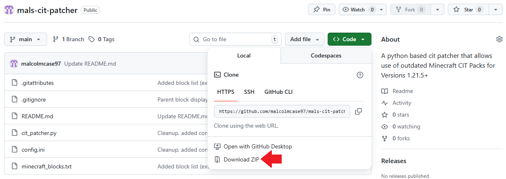
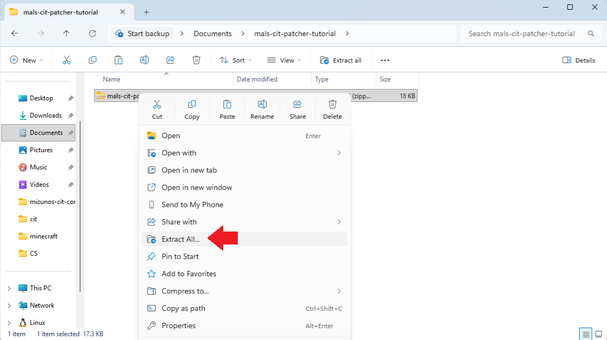
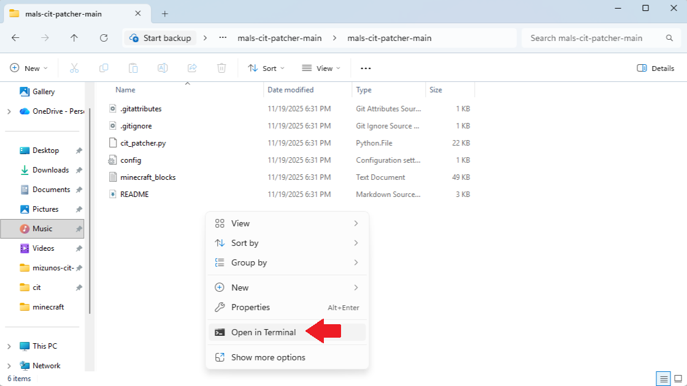
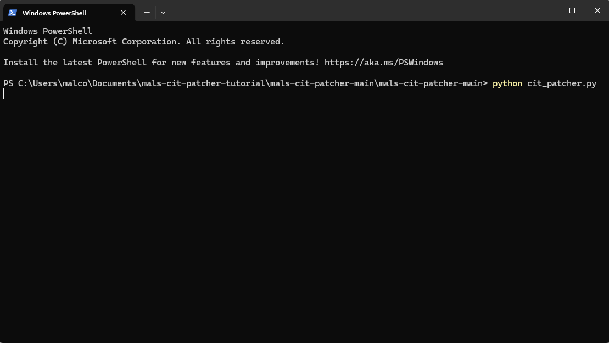
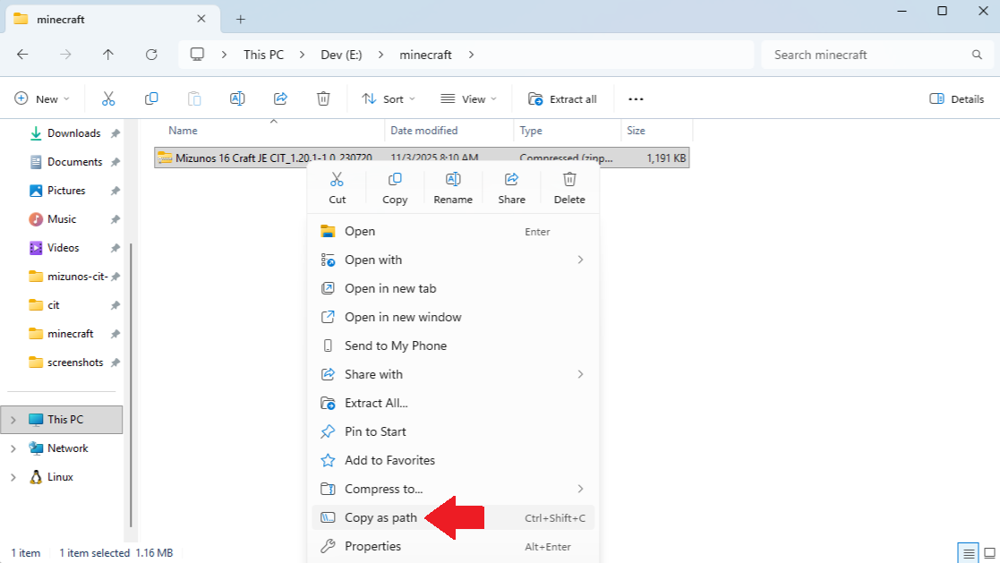
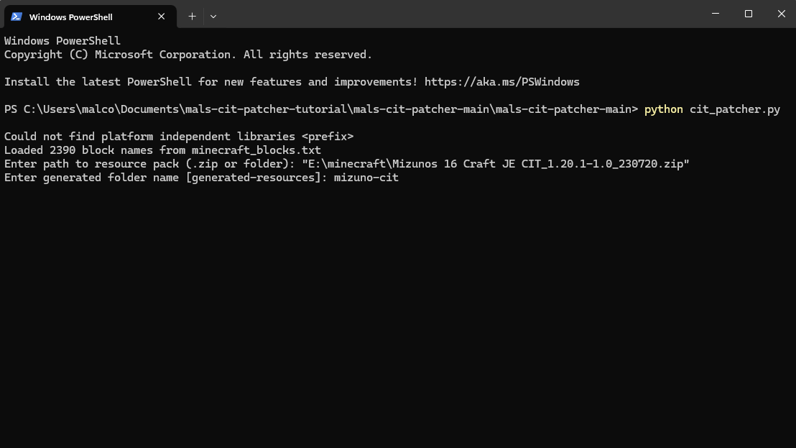

# Mal's CIT Resource Pack Patcher

A Python script to patch **Custom Item Textures (CIT)** in Minecraft resource packs for compatibility with Minecraft 1.21.5+.

Should be used on CIT resource packs that require Optifine on older Minecraft versions.

Requires *no* mods to use! All patched resource packs should be vanilla friendly!

It merges item models, rewrites textures, and handles special fallbacks automatically.

## Requirements

You must have **Python 3.8+** installed to run this script.

You can download Python here:  
[https://www.python.org/downloads/](https://www.python.org/downloads/)

## Usage

1. **Download the ZIP** of **mals-cit-patcher** from this GitHub page.

<div style="padding-left: 40px;">
  
</div>

---

2. **Unzip** the downloaded file.

<div style="padding-left: 40px;">
  
</div>

---

3. **Open the unzipped folder**, then **open a terminal** in the folder containing `cit_patcher.py`.

<div style="padding-left: 40px;">
  
</div>

---

4. In the terminal, **run the script**:

```bash
python cit_patcher.py
```

<div style="padding-left: 40px;">
  
</div>

---

5. When prompted, **enter the path to your resource pack.**
+ To get this path, right-click the resource pack and select **Copy as path**

<div style="padding-left: 40px;">
  
</div>

+ Then, paste it into the terminal with **Ctrl + V**

<div style="padding-left: 40px;">
  
</div>

---

6. When asked for a **generated folder name**, type any name you want that reflects the pack.

<div style="padding-left: 40px;">
  
</div>

---

7. When the script finishes, your patched resource pack will appear next to the original, named "Patched <original_pack_name>".

<div style="padding-left: 40px;">
  
</div>

## Configuration

Some settings can be modified within the config.ini file, described as follows:

+ generated_folder_name – Folder name for generated models and textures. This shouldn't be important but should probably be unique between packs.
+ patched_prefix – Prefix for output pack. For example: "Patched Mizuno's CIT Pack". This is unimportant, just here for preference.
+ verbose – Show log messages. True by default.
+ prompt_for_generated_name – Prompts user for folder name if true.

## TODO

+ This patcher is a work in progress and has only been tested to work with Mizuno's CIT Pack! If you find any issues with this pack, or any other CIT packs, please open an issue or contact me at [malcolm.case.97@gmail.com](mailto:malcolm.case.97@gmail.com).
+ Add compatibility with [Fast Item Frames](https://modrinth.com/mod/fast-item-frames), my preferred item invisible item frame mod. Currently, CIT models will clip into other blocks due to Fast Item Frame's imposed offset when hiding item frames.
+ Shield CIT models seem to have incorrect rotation, unlike all other models. They can simply be rotated to correct position, so I've ignored this for now.
+ Improve user experience by adding a simple GUI to the patcher.
+ Emissive textures don't work, will look into adding compatibility later on.

## Special Thanks

Thank you very much to [coolbot100s](https://modrinth.com/user/coolbot100s) and mars from the Garden Gals discord for helping me with this script! ❤️